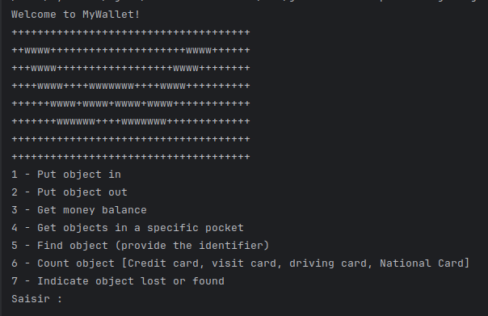

[](https://classroom.github.com/a/hy8NMZUz)


# MyWallet

Welcome to MyWallet! A simple commande line wallet simulator.


## Description
MyWallet will help to manage a virtual wallet. This app answers to question ```What if a wallet is managed via commande line?```

This app is implemented in ``4 differents programming language`` especially :
- [Java](#installation)
- [C#](#installation)
- [JavaScript](#installation)
- [Python](#installation)

## Installation
Use a modern IDE (Intellij, Eclipse,VSCode...) if possible 

- ```Java```
   * We recommend you to use ```java >= 17.0.9```
   * To bootstrap the application, run ``Main.java``
- ``#C``
   * We recommend you to use ```dotnet >= 7.0.114``` 
   * Build and run application : ``dotnet build`` , then ``dotnet run``
- ``JavaScript``
   * We recommend you to use ```node >= 16.20.2``` 
   * Then install ```npm install prompt-sync``` 
   * Run application : ``node main.js``
- ``Python``
   * We recommend you to use ```python >= 3.11.5``` 
   * Build and run application : ``python main`` , then ``dotnet run``
  
## How do the application work?
When the app is bootstrapping, we will in the console the folling menu :
<div>
  
</div>

``Notice`` : All of these features are already implemented expect the lost and found handling [7]